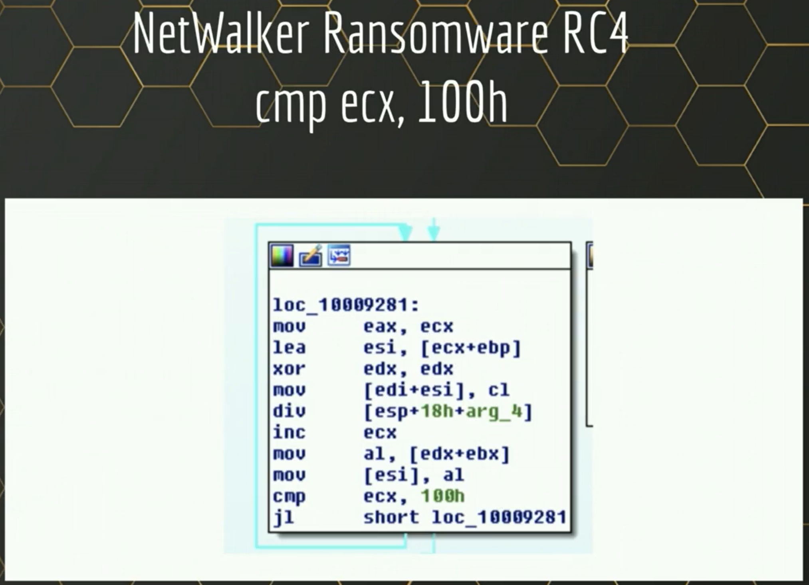

# Dennis Reversing Guide
## Identifying type of Encryption Algorithm used
## Encryption Algorithms
Common encryption algorithm includes
 - RC4
 - AES
 - 3DES
 - Serpent
 - Salsa20
 - Misty1
 - ECDH

#### Identifying Encryption Algorithms using Tools
KANAL automate the process of detecting encryption algorithms through constants.

#### API
   - CryptCreateHash
   - CryptEncrypt or CryptDecrypt
   - CryptGenKey
   
#### WinCrypt API
   - If WinCrypt API is used, it is usually obfuscated
*References: https://learn.microsoft.com/en-us/windows/win32/seccrypto/alg-id*

#### RC4
This is an example of 

