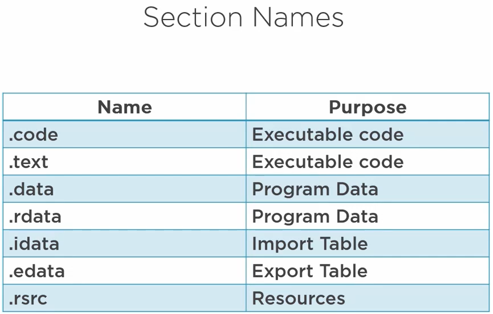

# Dennis Reversing Guide
## Glossary

## Definitions
Text Section (.text): The hub where the executable code of the program resides.
Data Section (.data): A storage for initialized global and static data variables.
Read-only initialized data (.rdata): Houses read-only data such as constant values, string literals, and initialized global and static variables.
Exception information (.pdata): A collection of function table entries utilized for exception handling.
BSS Section (.bss): Holds uninitialized global and static data variables.
Resource Section (.rsrc): Safeguards resources such as images, icons, strings, and version information.
Import Section (.idata): Details about functions imported from other DLLs.
Export Section (.edata): Information about functions exported by the executable.
Relocation Section (.reloc): Details for relocating the executable's code and data when loaded at a different memory address.

Import Address Table ("IAT"): Contains a list of DLLs and APIs loaded by the program at runtime.
```
When a program is compiled, it often relies on external functions or routines provided by dynamic-link libraries (DLLs) to perform certain tasks. Instead of including the entire code for these functions in the executable, the program includes references to the functions, and the actual addresses of these functions are determined at runtime. This is known as dynamic linking.

Threat Actor:
Some times the function in the IAT do not need to be specified by names, they could also be specified by *Ordinal numbers*. Ordinal numbers are just numerical offsets to the functions in the dll.

There will be times where malware authors will use ordinal numbers instead of function names.
```
If the malware is 32-bit on a 64-bit system, you'll see it load libraries from SysWOW64.
